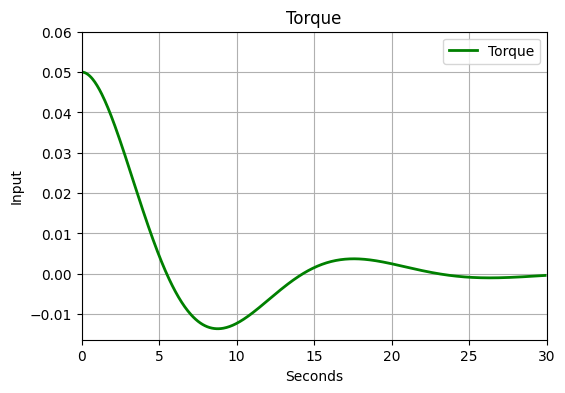
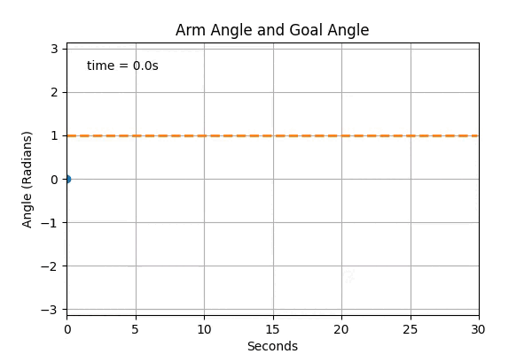
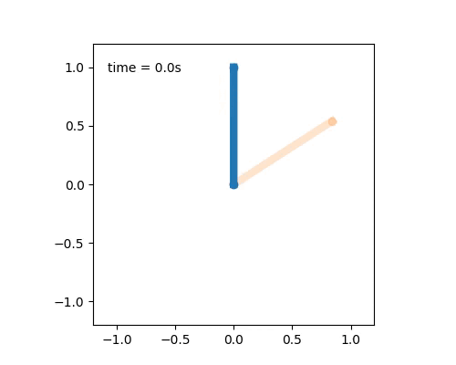
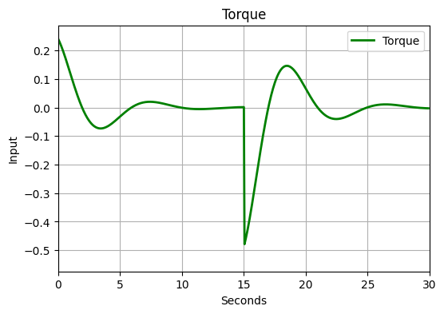
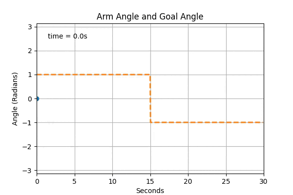

# Inverted-Pendulum
Balancing of inverted pendulum done in colab Credits to CMU Videos
For detailed explanations and interactive code, please open the Colab files:

<b>
</b>
 
 
 

 
Technical View of PID Algorithm for Balancing an Inverted Pendulum

<h1>PID Control Theory for Balancing an Inverted Pendulum</h1>

PID (Proportional-Integral-Derivative) control is a fundamental control theory used in control systems to maintain a desired output, such as speed, position, or temperature, by continuously adjusting inputs based on feedback. A PID controller calculates the error as the difference between a desired setpoint (SP) and a measured process variable (PV). It then applies a correction based on three components: proportional, integral, and derivative terms.

<h2>Overview of PID Components</h2>

<ul>
    <li><strong>Proportional (P):</strong> The proportional term responds to the current error. It provides an output directly proportional to the error, allowing the system to correct deviations quickly.</li>
    <li><strong>Integral (I):</strong> The integral term accounts for the accumulation of past errors. It helps to eliminate small errors that may not be fully corrected by the proportional term alone, achieving precise control over time.</li>
    <li><strong>Derivative (D):</strong> The derivative part predicts future error by considering the rate of change of the error. It reduces overshoot and prevents oscillations by slowing down the system as it approaches the desired value.</li>
</ul>

<h2>Applying PID Control to the Inverted Pendulum Problem</h2>

In this setup, sensors measure the <em>angle of the pendulum</em> (process variable, PV) relative to the upright position (desired setpoint, SP). The PID controller continuously calculates the error (the difference between SP and PV) and adjusts the <em>force applied to the cart</em> or <em>motor torque</em> that moves the base of the pendulum to keep it upright. The PID controller’s role is to determine the optimal corrective action using three components: Proportional, Integral, and Derivative.

<h3>Proportional (P) Component</h3>

The proportional term adjusts the corrective force based on the current tilt angle of the pendulum. When the pendulum tilts, the P component applies a force proportional to this tilt, aiming to push the pendulum back toward the upright position. However, relying on the proportional term alone can lead to persistent oscillations and an inability to fully stabilize the pendulum.

<h3>Integral (I) Component</h3>

The integral term addresses any accumulated tilt (persistent error) by summing up past errors over time. In an inverted pendulum, the integral term can help counteract small imbalances or external disturbances, allowing for precise control by correcting even small deviations that the proportional term might not fully handle. It acts as a correction to any residual tilt that might keep the pendulum from achieving true upright balance.

<h3>Derivative (D) Component</h3>

The derivative term predicts future tilt by measuring the rate at which the pendulum’s angle is changing. If the pendulum is tilting faster toward one direction, the D component applies a counteracting force proportional to this rate, effectively slowing down the corrective action as the pendulum nears the upright position. This helps to reduce overshoot and dampen oscillations, allowing for smoother and more stable balancing.

<h2>Challenges and Tuning PID for an Inverted Pendulum</h2>

The inverted pendulum problem requires fine-tuning the PID parameters (Kp, Ki, Kd) to achieve stability. The <strong>Proportional gain (Kp)</strong> must be large enough to respond quickly to tilting but not so high that it causes excessive oscillations. <strong>Integral gain (Ki)</strong> must be set to counteract persistent deviations without leading to instability. Finally, <strong>Derivative gain (Kd)</strong> is critical to dampen oscillations effectively but needs careful tuning, as too high a value can cause excessive sluggishness, and too low can lead to overshooting.

<h2>Summary</h2>

In PID-controlled inverted pendulum systems, each component of PID has a specific role:

<ul>
    <li><strong>P</strong> quickly responds to tilt.</li>
    <li><strong>I</strong> corrects minor errors over time.</li>
    <li><strong>D</strong> prevents overshoot by slowing the pendulum near the upright position.</li>
</ul>

This combination, when well-tuned, enables the controller to keep the pendulum balanced effectively and is commonly used as a foundational example for understanding the power of PID control.

 
 
Results:

<b>PController</b>
 

 
 

<b>PD-Controller</b>
 

